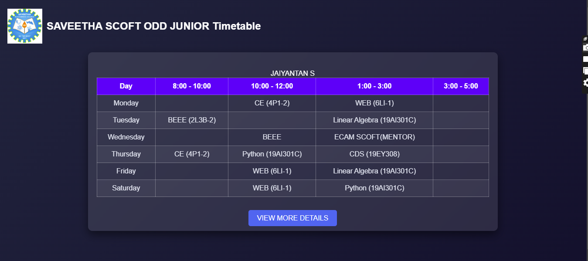
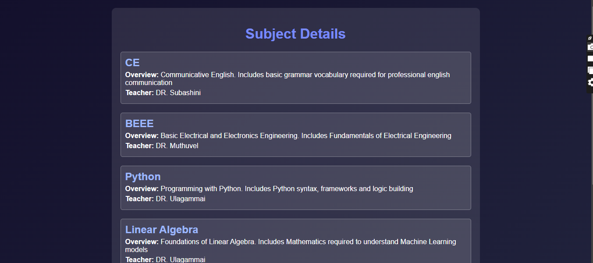

# Ex03 Time Table
# Date:
# AIM
To write a html webpage page to display your slot timetable.

# ALGORITHM
## STEP 1
Create a Django-admin Interface.

## STEP 2
Create a static folder and inert HTML code.

## STEP 3
Create a simple table using `<table>` tag in html.

## STEP 4
Add header row using `<th>` tag.

## STEP 5
Add timetable using `<td>` tag.

## STEP 6
Execute the program using runserver command.

# PROGRAM :

# views.py:

    from django.shortcuts import render

    def timetable(request):
        return render(request, 'timetable.html')

    def subject_details(request):
    
        subjects = [
            {"name": "CE", "overview": "Communicative English. \n Includes basic grammar vocabulary required for professional english communication", "teacher": "DR. Subashini"},
            {"name": "BEEE", "overview": "Basic Electrical and Electronics Engineering. \n Includes Fundamentals of Electrical Engineering", "teacher": "DR. Muthuvel"},
            {"name": "Python", "overview": "Programming with Python. \n Includes Python syntax, frameworks and logic building", "teacher": "DR. Ulagammai"},
            {"name": "Linear Algebra", "overview": "Foundations of Linear Algebra. \n Includes Mathematics required to understand Machine Learning models", "teacher": "DR. Ulagammai"},
            {"name": "WEB", "overview": "Web Development Technologies.\n Includes networking and the know hows of the underlying Web Architecture", "teacher": "Ms. Berlin"},
        ]
        return render(request, 'subject_details.html', {'subjects': subjects})

# timetable.html:

    
    <!DOCTYPE html>
    <html lang="en">
    <head>
        <meta charset="UTF-8">
        <meta name="viewport" content="width=device-width, initial-scale=1.0">
        <title>Timetable</title>
        
    </head>
    <body>
        <header>
            
            <h1>SAVEETHA SCOFT ODD JUNIOR Timetable</h1>
        </header>
        

            

                <table>
                    <caption>JAIYANTAN S</caption>
                    <thead>
                        <tr>
                            <th>Day</th>
                            <th>8:00 - 10:00</th>
                            <th>10:00 - 12:00</th>
                            <th>1:00 - 3:00</th>
                            <th>3:00 - 5:00</th>
                        </tr>
                    </thead>
                    <tbody>
                        <tr>
                            <td>Monday</td>
                            <td></td>
                            <td>CE (4P1-2)</td>
                            <td>WEB (6LI-1)</td>
                            <td></td>
                        </tr>
                        <tr>
                            <td>Tuesday</td>
                            <td>BEEE (2L3B-2)</td>
                            <td></td>
                            <td>Linear Algebra (19AI301C)</td>
                            <td></td>
                        </tr>
                        <tr>
                            <td>Wednesday</td>
                            <td></td>
                            <td>BEEE</td>
                            <td>ECAM SCOFT(MENTOR)</td>
                            <td></td>
                        </tr>
                        <tr>
                            <td>Thursday</td>
                            <td>CE (4P1-2)</td>
                            <td>Python (19AI301C)</td>
                            <td>CDS (19EY308)</td>
                            <td></td>
                        </tr>
                        <tr>
                            <td>Friday</td>
                            <td></td>
                            <td>WEB (6LI-1)</td>
                            <td>Linear Algebra (19AI301C)</td>
                            <td></td>
                        </tr>
                        <tr>
                            <td>Saturday</td>
                            <td></td>
                            <td>WEB (6LI-1)</td>
                            <td>Python (19AI301C)</td>
                            <td></td>
                        </tr>
                    </tbody>
                </table>
            

            

                <a href="" class="view-details-btn">View More Details</a>
            

        

    </body>
    </html>

# details.html:

    <!DOCTYPE html>
    <html lang="en">
    <head>
        <meta charset="UTF-8">
        <meta name="viewport" content="width=device-width, initial-scale=1.0">
        <title>Subject Details</title>
        
    </head>
    <body>
        

            <h1>Subject Details</h1>
            
            

                <h2>{{ subject.name }}</h2>
                
<strong>Overview:</strong> {{ subject.overview }}

                
<strong>Teacher:</strong> {{ subject.teacher }}

            

            
        

        

            
                <a href="" class="view-details-btn">Back to TimeTable</a>
            
            
        

    </body>
    </html>

# OUTPUT:

# RESULT
The program for creating slot timetable using basic HTML tags is executed successfully.
